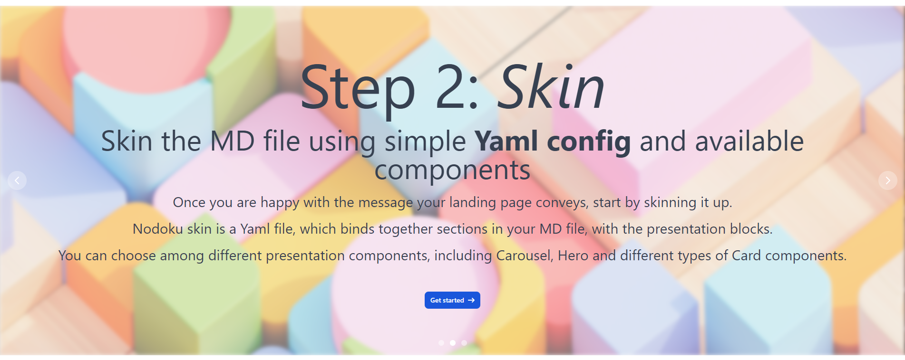
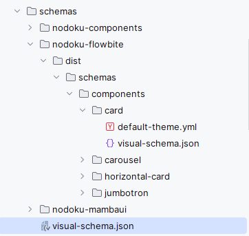

<!-- TOC -->
* [Nodoku foundation](#nodoku-foundation)
  * [Nodoku content flow](#nodoku-content-flow)
  * [Nodoku skin](#nodoku-skin)
* [Getting started](#getting-started)
  * [Prerequisites](#prerequisites)
  * [Installation](#installation)
  * [Integrating Nodoku into a project](#integrating-nodoku-into-a-project)
    * [Content parsing](#content-parsing)
    * [Loading of the skin Yaml file](#loading-of-the-skin-yaml-file)
    * [Rendering Nodoku](#rendering-nodoku)
  * [Nodoku component resolver](#nodoku-component-resolver)
* [Nodoku component bundle](#nodoku-component-bundle)
  * [Nodoku manifest](#nodoku-manifest-)
  * [Nodoku skin](#nodoku-skin-1)
    * [Nodoku visual component theme](#nodoku-visual-component-theme)
    * [The Nodoku skin Yaml file](#the-nodoku-skin-yaml-file)
    * [Schema for Nodoku skin Yaml file](#schema-for-nodoku-skin-yaml-file)
  * [Customizing Nodoku page appearance](#customizing-nodoku-page-appearance)
* [Nodoku generation scripts](#nodoku-generation-scripts)
<!-- TOC -->

Nodoku is a static site generator, where the content is provided via MD (markdown) files, and the visual representation is controlled using Yaml files - called _skin_.

Nodoku promotes the content-first approach, when the content creation process is not being distracted by the considerations related to the visual representation and design.

Instead, the content is created first as an MD file, demarcated by the special markers into content blocks, and then each block is rendered using the configuration provided in a Yaml file called _skin_.

Figure 1 shows a screenshot of a part of a landing page created with Nodoku.

<figure>
  
  <figcaption>
    <b>Figure 1</b>: A part of a landing page, created using Nodoku.
It has 3 cards, organized in a row, where the content of each card is supplied by an MD file. The mapping between content and visual representation is configured in a Yaml file.
  </figcaption>
</figure>


Nodoku is a set of libraries, the most important of which is nodoku-core, intended to be used with the **_NextJS_** framework for generation of static sites.

Nodoku is intended to be used in server side rendering, it is not suitable for client side.

nodoku-core doesn't contain the visual representation for content blocks. Instead, the visual representation is supplied via separated dependencies, such as **_nodoku-flowbite_** (components based on [Flowbite](https://flowbite.com/docs/getting-started/introduction/)) and **_nodoku-mambaui_** (components based on [MambaUI](https://mambaui.com/components/hero)).

More set of components can be added, and included in the project as required.

The structure of the skin files is organized by rows, each row having one or more components.

The mapping between visual representation and the content block is performed using the concept of _selector_. Selector is a set of matching conditions, attached to a visual component in the skin Yaml file. 

The actual rendering is performed in two steps:
- first, for a given visual component a set of matching content blocks is determined, using the selector and the meta-data of the content block


- second, this flow of content blocks is provided to the rendering mechanism of the visual component for actual rendering.

This decoupling allows for great level of flexibility and reuse between the content and the visual representation.

If the visual components support [Tailwind](https://tailwindcss.com/docs/installation), the Tailwind customization can be provided in the skin Yaml file to fine tune the visual representation. 

You can learn more about the rationale behind Nodoku and the main principles in the blog article: [Nodoku: a lo-code static site generator, promoting a content-first approach based on Markdown files](https://epanikas.hashnode.dev/nodoku-a-lo-code-static-site-generator-promoting-a-content-first-approach-based-on-markdown-files)

# Nodoku foundation

Nodoku is organized around two flows of data: 
- the content flow (supplied via a Markdown file)
- the visual representation flow (supplied via Yaml file called _skin_)

The Nodoku engine will take care of parsing these files and supply them to the designated visual components for rendering.

## Nodoku content flow

As has been mentioned above, the Nodoku content flow is supplied via an MD file.

The content flow in Nodoku is organized around an entity called _content block_, which is a single piece of content suitable for rendering by a Nodoku visual component. The set of such components constitute the Nodoku content flow. 

The content block has a predefined structure. It is designed to be more or less generic, and _visual representation agnostic_. In particular this is important to implement the _content-first_ principle, where the content can (and should!) be created first, without any visual design considerations.

Nodoku engine parses the MD file to extract the set of content blocks, that are contained in such file. The content blocks are delimited by a special markers - the content block delimiters.

The content block delimiter is a small piece of Yaml code snippet, embedded directly into the MD file. 

For example, the content, that has been used to generate the screeshnot on Figure 1 is the following:

```markdown

```yaml
nd-block:
  attributes:
    sectionName: nodoku-way
``

# Step 1: _Think_
## Create content promoting your product or service as an **MD file**
...
Concentrate on the subject of your product / service to highlight its advantages.
...
|Get started|

# Step 2: _Skin_
## Skin the MD file using simple **Yaml config** and available components
...
Once you are happy with the message your landing page conveys,
start by skinning it up.
...
|Get started|

# Step 3: _Fine tune_
## Use configuration options to fine tune your landing page presentation
...
If the default presentation doesn't suit your needs, you can tweak it up
using the config options of each component to fine tune it for your needs.
...
|Get started|

```

The first thing one would notice in this MD excerpt is the small Yaml code snippet.

```yaml
nd-block:
  attributes:
    sectionName: nodoku-way
```

This Yaml code snippet is a content block delimiter, and it contains the content block meta-data, such as _id_, _attributes_ and _tags_.

The schema for this Yaml code snippet can be found in the Json schema file : **_nodoku-core/docs/md-content-block-delimiter.json_**

The content block has the following predefined, fixed structure:
```typescript
class NdContentBlock {
    // content block meta-data
    id: string;
    lng: string;
    attributes: {key: string, value: string}[] = [];
    tags: string[] = []
    namespace: string;
    
    // the actual textual content
    title?: NdTranslatedText;       // a title
    subTitle?: NdTranslatedText;    // a subtitle
    h3?: NdTranslatedText;          // h3 header
    h4?: NdTranslatedText;          // h4 header
    h5?: NdTranslatedText;          // h5 header
    h6?: NdTranslatedText;          // h6 header
    footer?: NdTranslatedText;      // footer
    paragraphs: NdTranslatedText[]; // set of paragraphs
    bgImageUrl?: NdTranslatedText;  // background image 
    images: NdContentImage[] = [];  // set of images 
}
```
where _NdTranslatedText_ represents a piece of text, that can be used for i18next translation (see below)
```typescript
class NdTranslatedText {
    key: string;    // the translation key
    ns: string;     // the translation namespace
    text: string;   // the fallback text, extracted from content
}
```

As one can see, the content block _cannot_ contain more than instance of each type of headers: title (h1), subtitle (h2), h3, etc.

But it _can_ contain several headers of different types, for example, a title (h1) and subtitle (h2)

> Hence, the parsing of the MD file goes as follows:
> - if the Yaml nd-block is encountered, a new content block is started, which would absord all the content elements that are discovered below, until a new content block is started
> - if a header (of any kind) is encountered
>   - if a header of the same kind or below exists in the current block
>     - finalize the current block
>     - start a new block
>     - and copy the metadata from the current block to the new one
>   - otherwise
>     - add the corresponding header to the current block

This approach allows for smooth content definition, where a common content block metadata is defined only once, and all the subsequent pieces of content are treated as new blocks with the same metadata.

Thanks to this parsing approach, the excerpt of the MD file, shown above, defines 3 content blocks - one per card shown on the screenshot of Figure 1 - instead of only one.  


## Nodoku skin

Nodoku skin is a Yaml file which configures the visual representation of the content defined in a markdown file.

The Nodoku page layout is organized as a set of rows, each row having its configured set of components.

Each layout row can have one or more visual components.

Here is an example of a typical Nodoku skin file:

```yaml
rows:
  - row:
      components:
        - mambaui/card:
            selector:
              attributes:
                sectionName: nodoku-way
```

In this example, we define a row containing components of type _mambaui/card_

The selector defines the content blocks that should be rendered using this visual component. In our case, these are all the content blocks having an attribute `sectionName` equal to `nodoku-way`.

Recall, that according to our MD file we are actually having 3 content blocks matching this criteria: 
- Step 1: _Think_
- Step 2: _Skin_
- Step 3: _Fine tune_

Naturally, a single card component cannot display more than one content block.

Consequently, according to the skin Yaml file, the Nodoku engine will apply the same visual component definition to all the three matching content blocks. 

And this process will end up rendering the screenshot presented on Figure 1.

It's worth noting that a visual component can support arbitrary number of content blocks. For example, the _flowbite/carousel_ component can display any number of content blocks.

Consequently, if the skin Yaml file had the following configuration:
```yaml
rows:
  - row:
      components:
        - flowbite/carousel:
            selector:
              attributes:
                sectionName: nodoku-way
```

it would have had the following visual rendering:

<figure>
  
  <figcaption>
    <b>Figure 2</b>: Three content blocks, rendered as the carousel component.
  </figcaption>
</figure>


# Getting started

## Prerequisites

As has been mentioned above, Nodoku is a library intended to be used within the NextJS framework. The creation of a NextJS project is out of scope for the current documentation.

We assume that the user is already familiar with the following concepts:
- **_NextJS_**: 
  - Nodoku is written to be used in server side rendering in NextJS 
- **_Typescript_**: 
  - Nodoku is written using Typescript (5.x), it uses the ECMAScript Modules (ESM) as module standard. It doesn't ship as CommonJS or UMD modules.
- **_Tailwind CSS_**:
  -  Nodoku heavily relies on Tailwind for visual appearance. All the Nodoku components are using Tailwind for their default visual configuration. And Tailwind can be used for skin customization.
- **_React and JSX_**:
  - you need a basic knowledge of React and JSX as all the Nodoku visual compnents are async functions returning JSX (see the declaration of _AsyncFunctionComponent_). 
- **_Webpack config_**:
  - when using Nodoku with flowbite (see [nodoku-flowbite](https://github.com/nodoku/nodoku-flowbite)) it might be required to modify the default Webpack configuration to make sure only one instance of flowbite is used 

## Installation
In order to use Nodoku one needs to install the **_nodoku-core_** library (this one) and at least one component library for Nodoku (for example, nodoku-flowbite)


```shell
npm install nodoku-core nodoku-flowbite
```

## Integrating Nodoku into a project

The entry point of a Nodoku library is the **_RenderingPage_** component.

This component receives as properties the flow of content blocks and the skin, and renders accordingly.

Here is a typical example of the usage of the RenderingPage TSX component:

```tsx

// load and parse the content MD file
const content: NdContentBlock[] = await contentMarkdownProvider("<url location of the content file>.md", "en", "nodoku-landing")

// load the Yaml skin file
const skin: NdPageSkin = await skinYamlProvider("<url location of the skin file>.yaml")

...

<RenderingPage
        lng={lng}
        renderingPriority={RenderingPriority.skin_first}
        skin={skin}
        content={content}
        componentResolver={defaultComponentResolver}
/>
```

### Content parsing

First, we parse the content MD file, using the predefined function _contentMarkdownProvider_.

The implementation of this function is intentionally kept simple, so that it can easily be replaced by a custom provider, if for some reason the standard one cannot be used

```ts
async function contentMarkdownProvider(
    mdFileUrl: string,
    contentLng: string, 
    ns: string): Promise<NdContentBlock[]> {
    
    return await fetch(mdFileUrl)
        .then(response => response.text())
        .then(fileContent => {
            return parseMarkdownAsContent(fileContent, contentLng, ns)
        })
}
```

The real parsing happens in the function _parseMarkdownAsContent_, which can also be used directly, if for some reason the URL of the MD file is not available.   

The result of this phase is the set of content blocks, represented as an array of _NdContentBlock_ items.

### Loading of the skin Yaml file

Likewise, there is a readily available parser for Yaml files, used as Nodoku skin. Recall, that _skin_ is a configuration for visual page rendering.

```ts
async function skinYamlProvider(yamlFileUrl: string): Promise<NdPageSkin> {
    return await fetch(yamlFileUrl)
        .then(response => response.text())
        .then(parseYamlContentAsSkin);
}
```

If, for some reason, the standard implementation is not suitable for particular needs, one can easily replace this function by another one, using _parseYamlContentAsSkin_ as the actual parser.

The result of this parsing is an instance of _NdPageSkin_, which conveys the necessary information regarding the Nodoku skin.

### Rendering Nodoku

Finally, when the skin and content are loaded, we can invoke the actual rendering using the provided component _RenderingPage_.

RenderingPage is an async JSX function, which is suitable for usage in the NextJS environment.

Let's have a closer look at its properties:

```ts
class RenderingPageProps {
    lng: string;
    content: NdContentBlock[];
    skin: NdPageSkin | undefined = undefined;
    renderingPriority: RenderingPriority = RenderingPriority.content_first;
    componentResolver: ComponentResolver | undefined = undefined;
    imageUrlProvider: ImageUrlProvider | undefined = undefined;
    i18nextProvider: I18nextProvider | undefined = undefined;
}
```

- **_lng_**: the language in which the page should be rendered. Nodoku supports localization out of the box (see more on Nodoku localization in [nodoku-i18n](https://github.com/nodoku/nodoku-i18n))


- **_content_**: the content flow, represented as an array of NdContentBlock instances. The content blocks are usually parsed from a Markdown file using the provided parser _contentMarkdownProvider_.


- **_skin_**: an instance of NdPageSkin class representing the Nodoku skin - configuration of the visual representation of the page. It is usually loaded from a Yaml file using the supplied loader _skinYamlProvider_.


- **_renderingPriority_**: this parameter is an enum that can have two values:
  - > **_content_first_**: the content is rendered as it appears in the markdown file, sequentially, block by block, from top to bottom. If a visual component is configured in the skin Yaml file, this visual component is used for rendering the content block. Otherwise, a default visual component is used
  - > **_skin_first_**: the rendering is fully prescribed by the skin Yaml file. The components are rendered in the order they appear in the Yaml file
    If a content block is not matched by any of the visual components in the skin Yaml file, it is not rendered at all. If a content block matches more than one visual component, each visual component is rendered, and the same content block will appear several times on the page.


- **_componentProvider_**: the function returning an actual implementation of the component, given its name, as specified in the skin. The signature is as follows: 
  > ```(componentName: string) => Promise<AsyncFunctionComponent>```
  > 
  where AsyncFunctionComponent is the following function: 
  > ```(props: NdSkinComponentProps) => Promise<JSX.Element>```
  
  the actual implementations, respecting the _AsyncFunctionComponent_ signature, are usually supplied via the component bundles, such as **_[nodoku-flowbite](https://github.com/nodoku/nodoku-flowbite)_** and **_[nodoku-mambaui](https://github.com/nodoku/nodoku-mambaui)_**   


- **_imageUrlProvider_**: the function allowing to customize the image URL conversion for rendering. It may so happen that the URL of images appearing in the MD file are different from those appearing on the page. For example, we often use the relative notation for images in the MD file, whereas this is not suitable for page rendering. The conversion between URL's in the MD file, and the URL's on the page can be provided using this parameter. The default implementation strips the leading dots, thus naively converting a relative url to an absolute one. Like this (more sophisticated patterns can be implemented, if required): 
  > **_../images/my-image-123.png_** will be converted to **_/images/my-image-123.png_**  


- **_i18nextProvider_**: this parameter can be used to provide the localization mechanism for Nodoku. This function is supposed to return an object containing the **_t()_** function, which will further be used for translating the text. 
  > type I18nextProvider = (lng: string) => Promise<{t: (text: NdTranslatedText) => string}>

  Note, that the provided **_t()_** function takes as an argument the whole NdTranslatedText structure, which contains the translation namespace, the key and the default value, extracted from the content.

  For more details see [nodoku-i18n](https://github.com/nodoku/nodoku-i18n)  

## Nodoku component resolver

The component resolver is expected to resolve each component name in a textual form, as extract from the skin file, to an actual component definition, among other things containing the actual Javascript function that should be called to render the component.

> As the components are provided as external dependencies, Nodoku supplies a special script - **_nodoku-gen-component-resolver_** - that should be launched from command line to automatically generate the component resolver.  

Here is the typical example of the generated component resolver, that is crucial for successful functioning of Nodoku:

```ts

import {AsyncFunctionComponent, DummyComp, NdComponentDefinition} from "nodoku-core";

import { NodokuFlowbite } from "nodoku-flowbite";

const components: Map<string, {compo: AsyncFunctionComponent, compoDef: NdComponentDefinition}> = 
        new Map<string, {compo: AsyncFunctionComponent, compoDef: NdComponentDefinition}>();

components.set("flowbite/card", {
    compo: NodokuFlowbite.Card, 
    compoDef: new NdComponentDefinition(1, 
            "./schemas/nodoku-flowbite/dist/schemas/components/card/default-theme.yml")
});

// other component definitions go here

export function nodokuComponentResolver(componentName: string): Promise<{compo: AsyncFunctionComponent, compoDef: NdComponentDefinition}> {
    const f: {compo: AsyncFunctionComponent, compoDef: NdComponentDefinition} | undefined = 
            components.get(componentName);
    return Promise.resolve(f ? f : {compo: DummyComp, compoDef: new NdComponentDefinition(1)});
}

```

Recall that the _componentResolver_ is one of the properties of the _RenderingPage_ component.

Thanks to this function Nodoku can find the correspondence between the component name specified in the skin Yaml file, and the actual component implementation.

It is worth noting here that **_nodoku-core_** is the Nodoku engine, which contains the resolving and parsing functionality, but it contains no visual components.

The visual components are supposed to be supplied as external library dependency, such as _nodoku-flowbite_ and _nodoku-mambaui_.  

The static map, that is generated by the scirpt _nodoku-gen-component-resolver_, associates with each component name two attributes: 
- **_compo_**: the function that is to be called to render the component
- **_compoDef_**: the definition of the component. The component defintion is loaded from the Nodoku manifest, supplied in the bundle where this component is defined. The component definition includes the following fields:
  - **_numBlocks_**: the maximum number of blocks this component supports
  - **_defaultThemeYaml_**: the Yaml file defining the default component visual configuration (usually uses Tailwind class names)


These components parameters are defined in a special file - **_nodoku.manifest.json_** - which is supposed to be shipped within the component bundle. See below for more details.

# Nodoku component bundle

As has already been mentioned above, Nodoku visual components are supplied as a component bundle - a standard NPM dependency, that can be installed using the standard NPM installation process
> ```npm install <nodoku component bundle>``` 

for example:
> ```npm install nodoku-flowbite```

## Nodoku manifest 

Each component bundle should be shipped with a special file called **_nodoku.manifest.json_**.

This json file is a visit card of the component bundle: it contains all the information required for Nodoku engine to treat correctly the component and use it following the configuration in the Nodoku skin Yaml file.

Here is an excerpt from such file for nodoku-flowbite:

```json
{
  "namespace": "NodokuFlowbite",
  "components": {
    ..
    "flowbite/carousel": {
      "schemaFile": "./dist/schemas/components/carousel/visual-schema.json",
      "optionsFile": "./dist/schemas/components/carousel/options-schema.json",
      "defaultThemeFile": "./dist/schemas/components/carousel/default-theme.yml",
      "implementation": "Carousel",
      "numBlocks": "unlimited"
    },
    ...
  }
}
```

Let's have a closer look at the attributes of each Nodoku visual component:

- **_namespace_**: the Javascript namespace where out of which the component is being exported. 
  
  The presence of the namespace attribute instructs the generator of the component resolver (nodoku-gen-component-resolver) to insert the component definition prefixed with the namespace.
  ```ts
  import { NodokuFlowbite } from "nodoku-flowbite";
  components.set("flowbite/carousel", {compo: NodokuFlowbite.Carousel, ...});
  ```
  The Nodoku manifest cannot have more than one namespace.


-  **_components_**: is a object associating a textual component name with the data structure that is used to extract the component definition. This data structure include:


  - **_schemaFile_**: is a Json schema file representing the data structure of the visual theme of the component (see [Nodoku skin schema](#nodoku-skin-schema))  


  - **_optionsFile_**: is a Json schema file representing the data structure of the functional options of the component (see [Nodoku skin schema](#nodoku-skin-schema))


  - **_defaultThemeFile_**: a Yaml file containing the default Tailwind configuration of the component


  - **_implementation_**: the actual Javascript function rendering this compnent. (the signature should correspond to _AsyncFunctionComponent_)


  - **_numBlocks_**: number of content blocks this component can accept for rendering. This parameter can either be a positive number of the predefined value '_unlimited_'


The _numBlocks_ parameter is used by the Nodoku engine to calculate the correct number of content blocks this visual component is capable of rendering. This parameter is normally either **_1_** or **_'unlimited'_**.

The _defaultThemeYaml_ attribute is an important parameter designating the Yaml file where the default Tailwind configuration is located. Normally each Nodoku visual component comes as an empty JSX scaffolding, which delegates the styling - the actual Tailwind classes - to the external data structure, the component default theme.

## Nodoku skin


The Nodoku skin is a Yaml file which configures the Nodoku rendering. 

Recall, that in Nodoku there is a strict separation between the content and the visual representation.

The content is provided via an MD file, whereas the mapping between the content blocks and visual components are defined in the _skin_. 

The skin also defines the necessary customizations and fine-tuning of the page visual representation, if required.

### Nodoku visual component theme

Normally, each JSX block in a visual component is styled using the Tailwind class names. This styling is typically composed of two parts: _base_ and _decoration_.

Consider the following example:

```tsx
<h3 className={`${effectiveTheme.titleStyle?.base} ${effectiveTheme.titleStyle?.decoration}`}>
  {t(block.title)}
</h3>

<h4 className={`${effectiveTheme.subTitleStyle?.base} ${effectiveTheme.subTitleStyle?.decoration}`}>
  {t(block.subTitle)}
</h4>
```

The component theme is supplied to the component by the Nodoku engine, and comes in as a data structure containing two elements: 
- one for title styling _effectiveTheme.**titleStyle**_
- and one for subtitle styling _effectiveTheme.**subTitleStyle**_

Each such element is called _ThemeStyle_, and is composed of two string attributes: _base_ and _decoration_

The component theme consists of several attributes of type _ThemeStyle_.

Here is an excerpt from the component theme _flowbite/card_

```ts
export class CardTheme {
    ...
    titleStyle?: ThemeStyle;
    subTitleStyle?: ThemeStyle;
    ...
}
```
where ThemeStyle is defined as follows:
```ts
export class ThemeStyle {
    base: string;
    decoration: string;
}
```

For each component there is a default theme supplied in a Yaml file, and this file is defined for the given visual component in the Nodoku manifest.

In addition, the theme of each component can further be customized in the skin Yaml file.


### The Nodoku skin Yaml file


The skin Yaml file has a predefined structure, which can be summarized as follows:

```yaml
global:
  renderingPage:
    # styles applied to the whole page
  theme:
    # attributes defined on the global level for all the component themes
  themes:
    # contains the list of theme customizations, where each theme from the list is applied sequentially on each content block rendered by the component of a given type in a single row
  components:
    <component-name>:
      theme:
        # defines a theme customization for a particular component
      themes:
        # defines a list of theme customizations for a particular component, where each theme from the list is applied sequentially on each content block rendered by the component of this type in a single row

rows:
  # list of rows
  - row:
      theme:
        # styling classes applied on the row level
      maxCols:
        # optional: a limit on a number of visual components in a row. By default, the max number of elements in a row is 12 (grid-cols-12 from Tailwind) but it can be reduced to 1, when we need content blocks to be located one beneat the other
      components:
        <component-name>:
          selector:
            # the data structure defining the selector to be applied on content blocks to select the matching content blocks that would be rendered by this component
          options:
            # a component may accept an options object, which can be defined here 
          theme:
            # the customization of the component's scheme
          themes:
            # a list of theme customizations for the given component, where each theme from the list is applied sequentially on each content block rendered by the component of this type in a single row
```

The customization is applied progressively, from the least specific theme to the most specific, starting from the default theme of the component.

Since the Nodoku skin file is large, and can contain many customization options, it is desirable to have a schema file that would guide the user through the process of defining and editing of the skin.

### Schema for Nodoku skin Yaml file

In order to make the Nodoku skin creation process more convenient and predictable, Nodoku provides a possibility to create a schema file for a project, with a given set of Nodoku component bundles, defined in NPM dependencies (in package.json).

Similar to the generation script for Nodoku component resolver, there is a script for generation of the Nodoku skin schema: **_nodoku-gen-skin-schema_**

One can run this script to automatically generate a Nodoku skin schema file.

The schema file by default is generated in the folder 
> <project folder>/schemas

After the schema generation script completes, the **_./schemas_** folder should look as follows:

<figure>
  
  <figcaption>
    <b>Figure 3</b>: The <b>./schemas</b> folder contains the schema file - <b>visual-schema.json</b> - to be applied on the Nodoku skin Yaml file
  </figcaption>
</figure>

The generated schema file - ./schemas/visual-schema.json - can be applied to the skin Yaml file in several ways:
- use [the IDE mechanism of schema application](https://www.jetbrains.com/help/idea/yaml.html#json_schema)
- use the **_yaml-language-server_** header (the first row) for the Yaml file as follows:

  ```yaml
  # yaml-language-server: $schema=../../../schemas/visual-schema.json
  
  global:
    renderingPage:
      base: dark:text-gray-200 text-gray-700

  rows:
  - row:
      theme:
        decoration: mb-10

  ```

## Customizing Nodoku page appearance

The main principle of component customization in Nodoku consists of cascading application of themes, defined on different levels:
- **_global level_**: the section **_global_** in the Yaml file. This level can further be divided to
  - **_theme level_**: where any attribute for any component can be defined
  - **_component level_**: where attributes for a given component can be defined
- **_rows level_**: where the list of rows defines each its set of components
  - **_component in a row level_**: the most specific customization, where a particular component can be customized

The process of customization starts from the component's default theme and works its way through all the defined customizations, until the most specific level is reached.


# Nodoku generation scripts

The nodoku-core provides the following scripts, that are used to generate component resolver and visual schema, by scanning the **node_modules** folder of the project


- **nodoku-gen-component-resolver**: generates the component resolver by scanning node_modules and searching for nodoku component libraries - the libraries providing the nodoku.manifest.json file


- **nodoku-gen-visual-schema**: generates the json schema file thate can be used to validate the Nodoku skin schema file

To simplify the use of these script it is recommended to add them in the project's package.json file as follows:

```json
{
  ...
  "scripts": {
    "gen-component-resolver": "nodoku-gen-component-resolver",
    "gen-skin-schema": "nodoku-gen-skin-schema"
  },
  ...          
}
```

